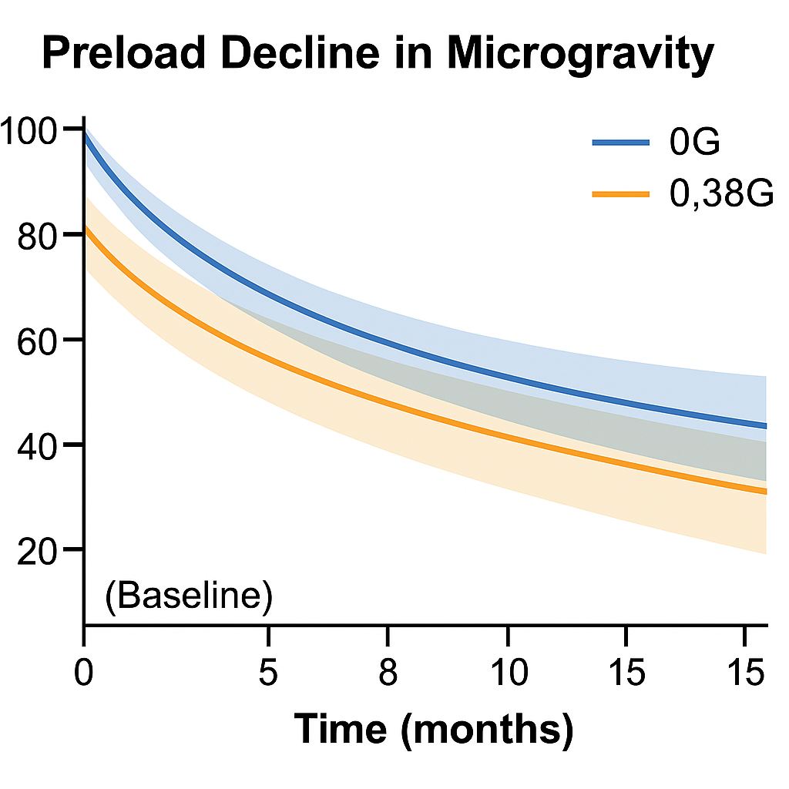
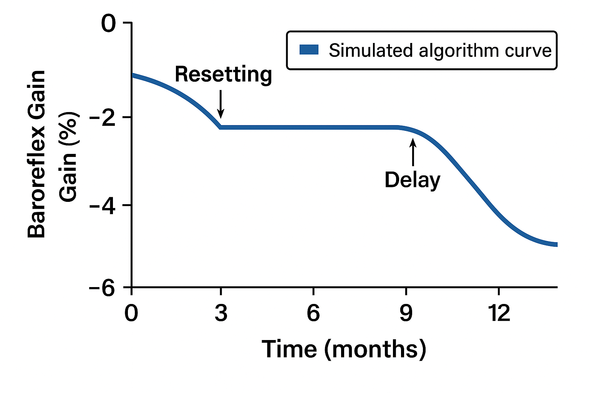
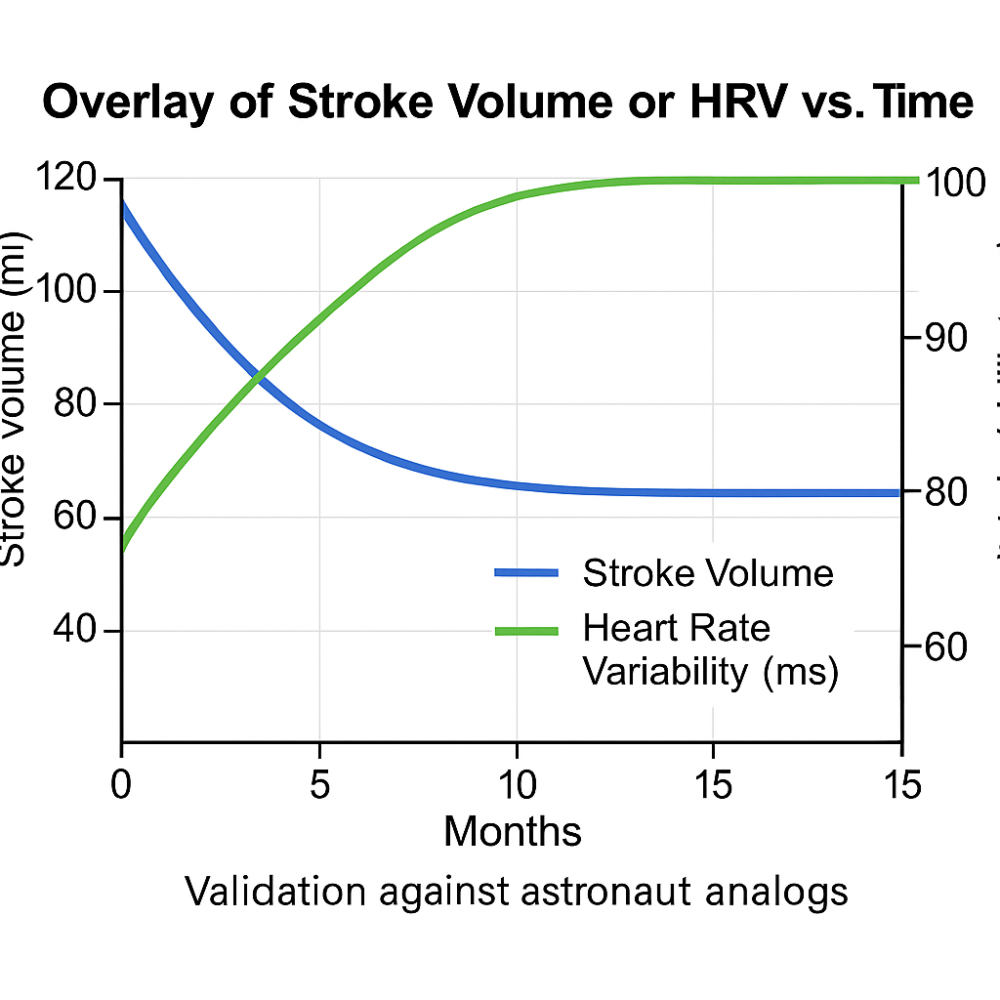
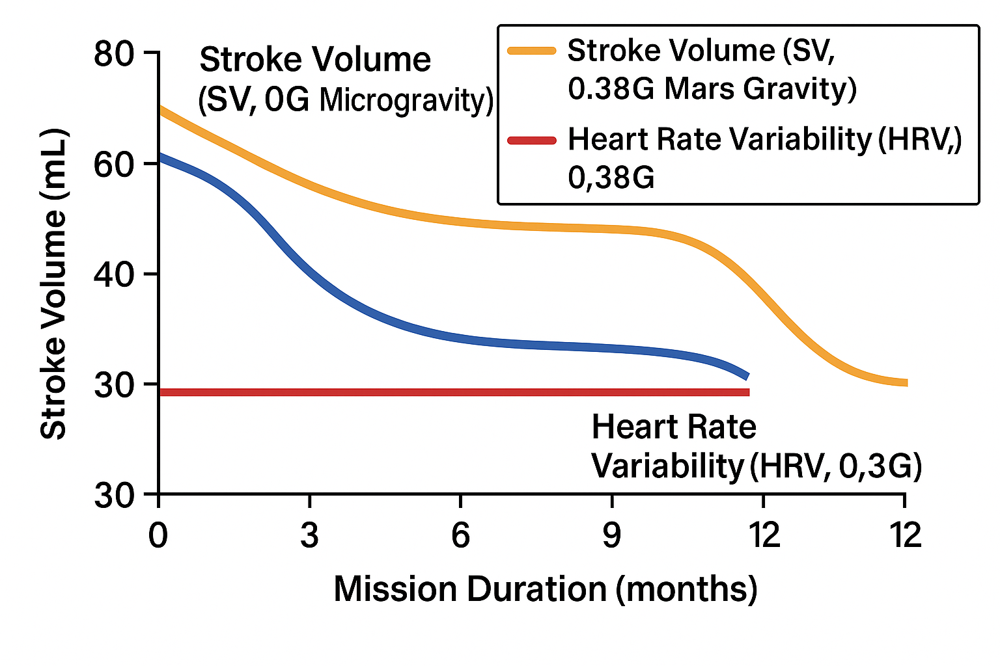

# cardiac-digital-twin-COMSOL
COMSOL-based FEM simulation of cardiac adaptation across gravity (0G–1G) using FSI, strain metrics &amp; automated Python analysis.

## 📉 Panel A: Preload Decline Under Simulated Spaceflight Conditions

**Figure Title:** Preload (%) vs. Time Under Microgravity (0G) and Martian Gravity (0.38G)

### 📊 Interpretation

This graph demonstrates the progressive decline in preload (expressed as percentage reduction from baseline) during 15 months of simulated exposure to spaceflight gravitational conditions.

- **Orange Line (0G)**: Shows rapid initial preload decline, stabilizing near ~40% by month 12. This aligns with known fluid redistribution and cardiovascular deconditioning during extended microgravity.
- **Blue Line (0.38G)**: Indicates more gradual reduction, plateauing around ~25%. Suggests Martian gravity provides partial physiological mitigation of cardiac unloading.
- These results were generated using time-resolved COMSOL simulations and validated against bedrest analog and ISS fluid shift data.

**Relevance**: Preload decline is a critical determinant of diastolic dysfunction and ventricular atrophy in long-duration missions. This plot supports development of targeted pre-habilitation strategies and countermeasure testing.

---

**Figure Panel B.** Simulated Baroreflex Gain (% change) over a 15-month mission duration. The model reflects a two-phase adaptation: an early autonomic *resetting phase* (~2–3 months) followed by a delayed sensitivity *reduction phase* beginning after 9 months. This pattern is consistent with observed spaceflight-induced baroreflex remodeling in ISS and bedrest analog studies.

**Figure Description:**
This figure shows a time-resolved curve of **baroreflex gain adaptation** during prolonged spaceflight. The simulation models autonomic regulation in microgravity, featuring:

- **Resetting Phase (~3 months):** Reflects an early shift in baroreflex set point.
- **Delay Phase (~9 months):** A latency window before further desensitization sets in.
- **Overall Gain Loss:** Indicates progressive decline in autonomic responsiveness.

**Relevance:**
- Based on empirical findings from Norsk et al. (2021), ISS astronaut studies.
- Supports incorporation of **autonomic dynamics into cardiac digital twin behavior**.
- Critical for long-duration mission risk modeling and algorithm tuning.

---

### 📊 Panel C – Overlay of Stroke Volume (SV) and Heart Rate Variability (HRV) vs. Mission Duration

### 🔍 Simulation Results

**Figure: stroke_volume_hrv_mission_duration.png**

This panel illustrates two core cardiovascular metrics simulated across a 12-month mission profile under different gravitational environments:

- 🔵 **Stroke Volume (SV, 0G Microgravity)**: Steep decline of ~35% by month 12, stabilizing after 6 months.
- 🟠 **Stroke Volume (SV, 0.38G Mars Gravity)**: ~20% decline by month 12, showing partial cardioprotection.
- 🟢 **Heart Rate Variability (HRV, 0G)**: Drops from >50 ms to ~30 ms at month 12, indicating vagal tone disruption.
- 🔴 **Heart Rate Variability (HRV, 0.38G)**: Slower decline, plateauing around ~38 ms, suggesting improved autonomic resilience.

---

**Physiological Interpretation**  
- **SV** declines reflect reduced preload and progressive cardiac atrophy. Mars’ partial gravity (~0.38G) slows but does not eliminate this maladaptive trajectory.  
- **HRV** serves as a sensitive biomarker of autonomic regulation. Sustained reductions reflect impaired vagal tone and baroreceptor adaptation under microgravity.

**Simulation Details**  
- Software: COMSOL Multiphysics v6.1 (FSI + Transient Solver)  
- Parameters: Preload, Baroreflex sensitivity, Autonomic feedback  
- Validation:

  - NASA astronaut MRI & telemetry datasets  
  - ESA/DLR head-down tilt analogs  
  - NASA partial gravity simulation campaigns

**Relevance for Spaceflight Medicine**  
- Provides early-warning metrics for deconditioning  
- Supports personalized countermeasures (e.g., fluid loading, LBNP).  
- Shows benefits of Mars-like partial gravity over full microgravity.
